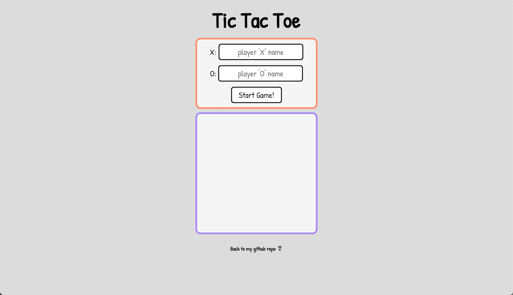

# Tic Tac Toe Project

Live Demo: https://ts-oh.github.io/js-tic-tac-toe/

## Screenshots

## This is a Tic-Tac-Toe project from 'The Odin Project'

- Used: JavaScript, CSS, and HTML.

- Implementation:
  
  - [x] Your main goal here is to have as little global code as possible. Try tucking everything away inside of a module or factory. Rule of thumb: if you only ever need ONE of something (gameBoard, displayController), use a module. If you need multiples of something (players!), create them with factories.
  
  - [x] Set up your HTML and write a JavaScript function that will render the contents of the gameboard array to the webpage (for now you can just manually fill in the array with "X"s and "O"s)
  
  - [x] Build the functions that allow players to add marks to a specific spot on the board, and then tie it to the DOM, letting players click on the gameboard to place their marker.
  
  - [x] Don’t forget the logic that keeps players from playing in spots that are already taken! Think carefully about where each bit of logic should reside. Each little piece of functionality should be able to fit in the game, player or gameboard objects.. but take care to put them in “logical” places. Spending a little time brainstorming here can make your life much easier later!
  
  - [x] Build the logic that checks for when the game is over! Should check for 3-in-a-row and a tie.
  Clean up the interface to allow players to put in their names, include a button to start/restart the game and add a display element that congratulates the winning player!

### Lessons/Comments

I learned a lot about the concept of closure and Object Oriented Programming in this project. One of the ways of using closure was through the use of factory functions. A lot like Class, inside the factory function I could create methods and variables. Furthermore expose only what I wanted by returning them as an object. Overall it was great learning experience to practice OOP concepts in Javascript.

